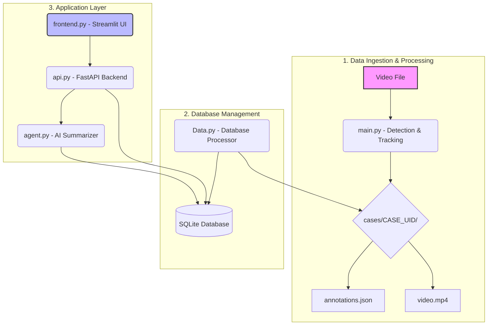

# 🩺 Polyp Detection AI Project

A **full-stack, AI-powered system** for detecting, tracking, and analyzing polyps in medical videos.
This project integrates **real-time ONNX-based detection**, **AI summarization**, and a **Streamlit web interface** — all supported by a **FastAPI backend** and **SQLite database**.

---

## ✨ Key Features

* **🎯 AI-Powered Polyp Detection**
  Detects and classifies polyps in real-time using an ONNX-based model.

* **🧠 Object Tracking**
  Employs a centroid tracking algorithm to maintain consistent IDs across video frames.

* **⚙️ Automated Data Processing**
  Processes uploaded videos, extracts metadata, and stores structured annotations automatically.

* **🗣️ Intelligent Case Summarization**
  An AI agent (LangChain + LangGraph) generates narrative or technical summaries of each case.

* **🌐 RESTful API (FastAPI)**
  Provides endpoints for managing cases, accessing data, and invoking AI summarization tasks.

* **💻 Interactive Web Frontend (Streamlit)**
  Offers an intuitive dashboard for uploading, reviewing, and analyzing polyp cases.

* **🧩 Centralized Configuration**
  All settings (model paths, thresholds, API keys) are managed through a single `config.yaml` file.

---

## 🏛️ Architecture Overview



### 📂 Module Breakdown

#### **1. Data Ingestion & Processing**

* `main.py`: Runs ONNX model inference for polyp detection and tracking.
* Outputs:

  * `annotations.json` (detection results)
  * `video.mp4` (processed video)
  * Stored inside unique folders under `cases/CASE_UID/`

#### **2. Database Management**

* `Data.py`: Scans new case folders, parses annotations, and stores structured data into SQLite.

#### **3. Application Layer**

* `api.py`: FastAPI backend exposing REST endpoints for CRUD operations and AI tasks.
* `agent.py`: LangChain-based AI summarizer for narrative or technical reports.
* `frontend.py`: Streamlit-based web UI for uploading videos, viewing results, and interacting with the AI agent.

---

## 🚀 Getting Started

### ✅ Prerequisites

* Python **3.8+**
* ONNX-compatible **polyp detection model**
* A valid **Groq API key** for the AI summarizer agent

---

### ⚙️ Step 1: Clone the Repository

```bash
git clone https://github.com/Daksh7565/Object_Detection_Project.git
cd Object_Detection_Project
```

---

### 🧰 Step 2: Set Up Virtual Environment

```bash
python -m venv venv
# Activate
source venv/bin/activate       # On macOS/Linux
venv\Scripts\activate          # On Windows
```

---

### 📦 Step 3: Install Dependencies

```bash
pip install -r requirements.txt
```

---

### 🧩 Step 4: Configure the Project

1. **Copy Example Config:**

   ```bash
   cp config.example.yaml config.yaml
   ```

2. **Edit `config.yaml`:**
   Update the following sections:

   * **paths:** Paths to ONNX model and case directory
   * **model:** Input size, confidence threshold, and class labels/colors
   * **database:** Name and path for the SQLite file
   * **agent:** Specify Groq LLM model name

---

### 🔐 Step 5: Set Up Environment Variables

Create a `.env` file in the project root:

```bash
key_sal_groq="YOUR_GROQ_API_KEY"
```

---

### 🗃️ Step 6: Initialize the Database

```bash
python Data.py
```

This command will create the SQLite database and required tables as specified in `config.yaml`.

---

## 💡 Usage Guide

You can run any of the three main components independently.

---

### 🎥 1. Process a Video (Manual / CLI)

Run the detection pipeline on a single video:

```bash
python main.py --video /path/to/your/video.mp4 --show
```

**Arguments:**

* `--video` *(required)* – Path to your video file.
* `--show` *(optional)* – Display a live preview during processing.

After completion:

* A new folder (`cases/CASE_UID/`) will contain:

  * `annotations.json`
  * `video.mp4`
* Run `Data.py` again to sync the database.

---

### ⚡ 2. Run the FastAPI Server

```bash
uvicorn api:app --reload
```

* API available at → [http://127.0.0.1:8000](http://127.0.0.1:8000)
* Interactive Docs → [http://127.0.0.1:8000/docs](http://127.0.0.1:8000/docs)

---

### 🖥️ 3. Launch the Streamlit Frontend

```bash
streamlit run frontend.py
```

Open the provided URL (usually [http://localhost:8501](http://localhost:8501)) to:

* Upload new videos
* Review cases and metadata
* Visualize detections
* Generate AI-based narrative or technical summaries

---

## 📁 Project Structure

```
Object_Detection_Project/
│
├── main.py                # Detection & tracking pipeline
├── Data.py                # Database population script
├── api.py                 # FastAPI backend
├── agent.py               # AI summarization agent
├── frontend.py            # Streamlit UI
│
├── config.example.yaml    # Example configuration file
├── config.yaml            # User-defined configuration
├── requirements.txt       # Project dependencies
├── .env                   # Environment variables
│
├── cases/                 # Stored processed video cases
│   └── CASE_UID/
│       ├── video.mp4
│       └── annotations.json
│
└── database/              # SQLite DB (auto-created)
```

---

## 🧠 AI Summarization Agent

* **Frameworks:** LangChain + LangGraph
* **LLM Provider:** Groq API
* **Functionality:**

  * Reads structured data from the database
  * Generates case summaries (standard, technical, or narrative styles)
  * Accessible via API or directly from the frontend

---

## 🧪 Example Workflow

1. Upload a colonoscopy video via the Streamlit UI.
2. The backend detects and tracks polyps frame-by-frame using the ONNX model.
3. Annotations are saved to `annotations.json`.
4. `Data.py` parses this and updates the database.
5. The user triggers the AI summarizer for case analysis.
6. The summary is displayed and stored for future review.

---

## 🧱 Tech Stack

| Layer                    | Technology                     |
| :----------------------- | :----------------------------- |
| **Detection & Tracking** | PyTorch, OpenCV, ONNX Runtime  |
| **Backend**              | FastAPI                        |
| **Frontend**             | Streamlit                      |
| **Database**             | SQLite ,SQLAlchemy             |
| **AI Summarization**     | LangChain, LangGraph, Groq API |
| **Configuration**        | YAML                           |
| **Environment**          | Python 3.8+                    |

---

## 🧾 License

This project is licensed under the **MIT License** — see the [LICENSE](LICENSE) file for details.

---

## 🤝 Contributing

Pull requests are welcome!
For major changes, please open an issue first to discuss your ideas.

---

## 📧 Contact

**Author:** Daksh Dubey
**GitHub:** [Daksh7565](https://github.com/Daksh7565)
**Project Repository:** [Object_Detection_Project](https://github.com/Daksh7565/Object_Detection_Project)

---

Would you like me to make this README **automatically formatted with emojis + GitHub badges (Python | FastAPI | Streamlit | ONNX)** for a more **professional repository look**?
